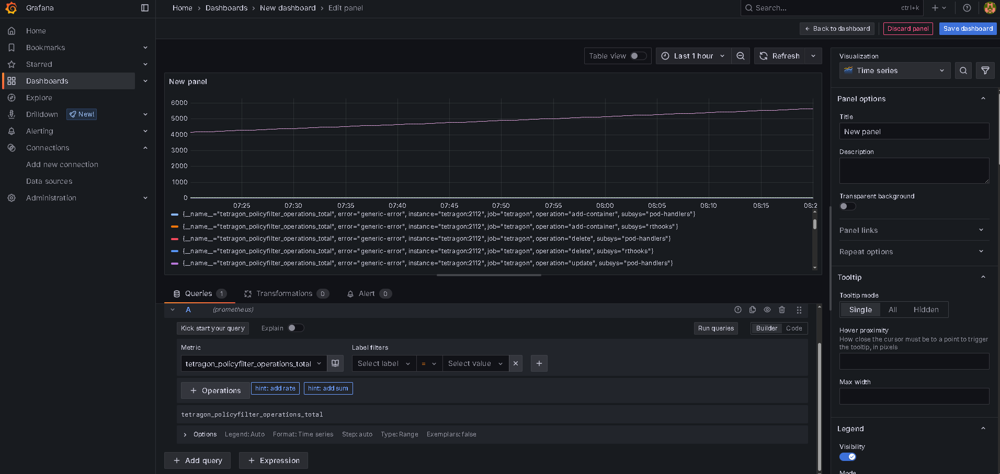

# Dokumentacja projektu

---

## Tytuł: Tetragon-OTel

**Autorzy:**  
- Dawid Kardacz  
- Michał Kuszewski  
- Adrian Madej  
- Adrian Mrzygłód  

**Grupa:** 5  
**Rok:** 2025  

---

## Spis treści

1. [Wprowadzenie](#1-wprowadzenie)  
2. [Podstawy teoretyczne i stos technologiczny](#2-podstawy-teoretyczne-i-stos-technologiczny)  
3. [Opis koncepcji studium przypadku](#3-opis-koncepcji-studium-przypadku)  
4. [Architektura rozwiązania](#4-architektura-rozwiązania)  
5. [Opis konfiguracji środowiska](#5-opis-konfiguracji-środowiska)  
6. [Metoda instalacji](#6-metoda-instalacji)  
7. [Jak odtworzyć projekt – krok po kroku](#7-jak-odtworzyć-projekt--krok-po-kroku)  
   - [7.1 Utworzenie klastra Kubernetes i wdrożenie aplikacji](#71-utworzenie-klastra-kubernetes-i-wdrożenie-aplikacji)
   - [7.2 Wdrożenie Tetragona](#72-wdrożenie-tetragona)
   - [7.3 Wdrożenie Prometheusa](#73-wdrożenie-prometheusa)
   - [7.4 Wdrożenie Grafany](#74-wdrożenie-grafany)
   - [7.5 Wdrożenie Lokiego](#75-wdrożenie-lokiego)
   - [7.6 Port forwarding](#76-port-forwarding)
8. [Kroki wdrożenia demonstracyjnego](#8-kroki-wdrożenia-demonstracyjnego)  
   - [Konfiguracja środowiska](#81-konfiguracja-środowiska)  
   - [Przygotowanie danych](#82-przygotowanie-danych)  
   - [Procedura wykonawcza](#83-procedura-wykonawcza)  
   - [Prezentacja wyników](#84-prezentacja-wyników)  
9. [Wykorzystanie AI w projekcie](#9-wykorzystanie-ai-w-projekcie)  
10. [Podsumowanie – wnioski](#10-podsumowanie--wnioski)  
11. [Bibliografia / Referencje](#11-bibliografia--referencje)  

---

## 1. Wprowadzenie

W projekcie opracowana została aplikacja funkcjonująca w środowisku Kubernetes, z naciskiem na integrację z systemem monitoringu i obserwowalności zgodnym ze standardem OpenTelemetry. Kluczową rolę pełni tutaj narzędzie **Tetragon**, wykorzystujące technologię **eBPF**, które pozwala na skuteczne śledzenie zdarzeń zachodzących w systemie operacyjnym i egzekwowanie polityk bezpieczeństwa bezpośrednio na poziomie jądra.

Tetragon umożliwia szczegółowe monitorowanie działań procesów, wywołań systemowych oraz operacji wejścia-wyjścia, jednocześnie uwzględniając kontekst środowiska Kubernetes, taki jak przestrzenie nazw, pody czy konkretne workloady. Dane te są zbierane w czasie rzeczywistym i przekazywane do **Grafany**, gdzie możliwa jest ich wizualizacja i dalsza analiza.

---

## 2. Podstawy teoretyczne i stos technologiczny

### 2.1 Podstawy teoretyczne

**Tetragon** to zaawansowane narzędzie służące do monitorowania bezpieczeństwa systemu oraz egzekwowania polityk w czasie rzeczywistym, zaprojektowane z myślą o nowoczesnych środowiskach chmurowych, w szczególności opartych na Kubernetes. Wykorzystuje technologię **eBPF** (extended Berkeley Packet Filter), co pozwala na wykonywanie obserwacji bezpośrednio w jądrze systemu operacyjnego bez konieczności modyfikowania aplikacji.

Główne możliwości Tetragona to:

- stosowanie reguł bezpieczeństwa i filtrów w jądrze systemu z minimalną utratą wydajności,
- natychmiastowa reakcja na wykryte zdarzenia o charakterze bezpieczeństwa,
- monitorowanie procesów i operacji systemowych w czasie rzeczywistym.

Tetragon rozpoznaje i rejestruje m.in.:

- uruchamianie procesów i ich dziedziczenie,
- wywołania systemowe (syscalls),
- dostęp do zasobów takich jak pliki czy sieć.

Dzięki świadomości kontekstu Kubernetes, Tetragon potrafi rozpoznać:

- namespace’y,
- pody,
- konkretne workloady lub kontenery.

Dzięki temu możliwe jest tworzenie bardzo precyzyjnych i kontekstowych polityk bezpieczeństwa oraz efektywne śledzenie działania aplikacji z punktu widzenia zarówno systemu operacyjnego, jak i platformy Kubernetes.

---

### 2.2 Stos technologiczny

Projekt został zrealizowany w lekkim, lokalnym środowisku testowym zbudowanym przy użyciu narzędzia **Kind (Kubernetes in Docker)**. Umożliwia ono szybkie tworzenie klastra Kubernetes w kontenerach Dockera, co jest idealnym rozwiązaniem do celów rozwojowych i testowych.

Zarządzanie wdrożeniem komponentów aplikacji oraz ich konfiguracją zostało zrealizowane za pomocą narzędzia **Helm** – menedżera pakietów dla Kubernetes. Helm pozwala na definiowanie aplikacji jako zestawu konfigurowalnych „chartów”, które można łatwo instalować, aktualizować i usuwać w klastrze.

Technologie wykorzystane w projekcie:

- **Kubernetes** – system orkiestracji kontenerów,
- **Kind** – środowisko uruchomieniowe dla lokalnego klastra Kubernetes,
- **Helm** – zarządzanie wdrożeniami i konfiguracją aplikacji,
- **Tetragon** – obserwowalność bezpieczeństwa i runtime enforcement oparty na eBPF,
- **Grafana** – wizualizacja danych telemetrycznych,
- **OpenTelemetry** – standard zbierania metryk, logów i śladów w aplikacjach rozproszonych.

---

## 3. Opis koncepcji studium przypadku

Głównym założeniem projektu było uruchomienie środowiska Kubernetes wraz z mechanizmem obserwowalności opartym na narzędziu **Tetragon** oraz standardzie **OpenTelemetry**. W tym celu wykorzystano prostą aplikację typu Guestbook – jej zadaniem jest umożliwienie użytkownikowi dodawania krótkich wpisów do wspólnego rejestru. Aplikacja została zaczerpnięta z przykładowych wdrożeń dostępnych publicznie i służy jako reprezentatywna, testowa usługa do celów monitorowania i analizy działania środowiska.

Wdrożenie ma charakter demonstracyjny – kluczowe było nie samo działanie aplikacji, lecz możliwość śledzenia zdarzeń systemowych i zachowania klastra z użyciem Tetragona. Dzięki temu możliwa jest analiza m.in. uruchamianych procesów, połączeń sieciowych czy interakcji z systemem plików, a wszystkie zebrane dane są kierowane do Grafany, gdzie można je w przejrzysty sposób wizualizować.

W efekcie uzyskano środowisko, które:

- **Można szybko odtworzyć** – całość uruchamiana jest automatycznie, bez konieczności ręcznego konfigurowania każdego elementu.
- **Nie jest zależne od konkretnej aplikacji** – demo można łatwo podmienić na dowolny inny serwis.
- **Może być uruchamiane lokalnie** – środowisko jest przystosowane do działania w klastrze Kind opartym na Dockerze, co umożliwia jego testowanie bez potrzeby korzystania z chmury.
- **Nadaje się do szybkich testów i demonstracji** – cały proces od uruchomienia klastra po uzyskanie widocznych danych w Grafanie jest zautomatyzowany i nie wymaga dodatkowej ingerencji.

Takie podejście pozwala na wygodne testowanie działania **Tetragona** oraz pozostałych narzędzi obserwacyjnych w kontrolowanym środowisku.


---

## 4. Architektura rozwiązania

Architektura rozwiązania opiera się na czterech głównych komponentach: **Tetragon**, **Prometheus**, **Loki** oraz **Grafana**, które wspólnie tworzą kompletny system obserwowalności dla aplikacji uruchomionej w środowisku Kubernetes.

Centralnym elementem jest narzędzie **Tetragon**, które odpowiada za monitorowanie zachowania procesów w systemie oraz śledzenie zdarzeń istotnych z punktu widzenia bezpieczeństwa (np. wywołania systemowe, połączenia sieciowe). Tetragon działa w pełni w oparciu o eBPF, co pozwala mu na zbieranie danych w czasie rzeczywistym i z minimalnym narzutem.

### Przepływ danych

- **Aplikacja Guestbook** działa w klastrze Kubernetes i generuje dane operacyjne.
- **Tetragon** przechwytuje zdarzenia systemowe oraz dane telemetryczne bezpośrednio z jądra systemu, w tym informacje o procesach, połączeniach i logach.
- **Metryki** (np. liczba operacji, opóźnienia, zdarzenia systemowe) są przekazywane do **Prometheusa**, który agreguje je i przechowuje w czasie.
- **Logi** i inne dane tekstowe przesyłane są do systemu **Loki**, który umożliwia ich filtrowanie i przeszukiwanie.
- Zarówno dane z **Prometheusa**, jak i z **Loki**, są następnie prezentowane w **Grafanie** – interfejsie wizualizacyjnym, umożliwiającym analizę działania aplikacji i całego środowiska.

### Diagram architektury

Poniższy schemat przedstawia ogólny przepływ danych pomiędzy komponentami systemu:


### Podsumowanie połączeń

- `Guestbook App → Tetragon` – zbieranie danych systemowych.
- `Tetragon → Prometheus` – eksport metryk.
- `Tetragon → Loki` – eksport logów.
- `Prometheus → Grafana` – wizualizacja metryk.
- `Loki → Grafana` – wizualizacja logów.

Dzięki takiej konfiguracji możliwe jest bieżące monitorowanie stanu systemu, analizowanie incydentów oraz diagnozowanie problemów w działaniu aplikacji bez konieczności instalowania dodatkowych agentów w środowisku.


---

## 5. Opis konfiguracji środowiska

Środowisko zostało zbudowane lokalnie przy użyciu narzędzia **Kind** (Kubernetes in Docker), które umożliwia szybkie uruchomienie klastra Kubernetes w kontenerach. Cała konfiguracja została przygotowana z myślą o łatwym testowaniu i demonstracji działania narzędzi obserwacyjnych oraz integracji komponentów w jednym, spójnym środowisku.

W ramach klastra uruchomiono dwie główne przestrzenie nazw (namespace):

- `application` – zawiera wdrożoną aplikację **Guestbook**, stanowiącą prosty system do zapisywania i wyświetlania wiadomości. Składa się z:
  - **3 podów frontendowych** (interfejs użytkownika),
  - **3 podów z bazą danych Redis** (obsługa przechowywania danych).

- `monitoring` – zawiera wszystkie komponenty związane z obserwowalnością i monitoringiem:
  - **Tetragon** – jako główne narzędzie obserwacyjne zintegrowane z eBPF,
  - **Prometheus** – złożony z **5 podów**, odpowiedzialny za zbieranie i przechowywanie metryk,
  - **Loki** – składający się z **2 podów**, służący do zbierania i przeszukiwania logów,
  - **Grafana** – zainstalowana jako pojedynczy pod, pełniący funkcję interfejsu wizualizacyjnego.

Wszystkie zasoby zostały wdrożone za pomocą narzędzia **Helm**, co umożliwia łatwą modyfikację konfiguracji oraz szybkie ponowne uruchomienie klastra.


---

## 6. Metoda instalacji

Do uruchomienia środowiska wymagane jest zainstalowanie kilku narzędzi wspierających pracę z Kubernetesem oraz zarządzanie jego komponentami. W projekcie wykorzystano następujące wersje oprogramowania:

- **Docker** – wersja `27.5.1`  
  Platforma do tworzenia, uruchamiania i zarządzania kontenerami, wymagana do działania Kind oraz do budowania lokalnych obrazów aplikacji.

- **Kind** – wersja `v1.32.3`  
Narzędzie do tworzenia lokalnych klastrów Kubernetes przy użyciu Dockerowych kontenerów jako węzłów.

- **Helm** – wersja `v3.17.3`  
  Narzędzie do zarządzania pakietami Helm Charts, umożliwiające łatwe wdrażanie i konfigurację aplikacji w Kubernetesie.

- **kubectl** – wersja `v1.32.4`  
  Oficjalne CLI do zarządzania zasobami Kubernetes. Umożliwia interakcję z klastrem, wdrażanie aplikacji oraz monitorowanie stanu komponentów.

Wszystkie narzędzia można zainstalować lokalnie na systemach Linux/macOS/Windows, korzystając z oficjalnych instalatorów lub menedżerów pakietów (np. `brew`, `apt`, `choco`). Przed uruchomieniem skryptów instalacyjnych należy upewnić się, że każda z wymienionych wersji jest poprawnie zainstalowana i dostępna w ścieżce systemowej (`$PATH`).


---

## 7. Jak odtworzyć projekt – krok po kroku

Poniżej przedstawiono szczegółowy proces uruchamiania środowiska oraz wdrażania aplikacji i komponentów obserwacyjnych. Całość bazuje na podejściu **Infrastructure as Code**, z wykorzystaniem narzędzi takich jak Helm oraz Kind.

---

### 7.1 Utworzenie klastra Kubernetes i wdrożenie aplikacji

1. Przejdź do katalogu projektu:

   ```bash
   cd <ścieżka-do-projektu>
   ```
   
2. Utwórz lokalny klaster Kubernetes za pomocą `kind`

   ```bash
   kind create cluster --name <nazwa>
   ```
   
3. Utwórz namespace dla aplikacji:
   ```bash
   kubectl create namespace application
   ```

4. Zainstaluj aplikację Guestbook:
   ```bash
   kubectl apply -f app-setup/all_in_one.yaml
   ```
---

### 7.2 Wdrożenie Tetragona

1. Utwórz namespace `monitoring`:
   ```bash
   kubectl create namespace monitoring
   ```

2. Dodaj repozytorium Helm i zainstaluj Tetragon:
   ```bash
   helm repo add cilium https://helm.cilium.io/
   helm repo update
   
   helm upgrade --install tetragon cilium/tetragon --namespace monitoring \
     --set tetragon.monitoring.enable=true \
     --set tetragon.network.enable=true \
     --set tetragon.network.networkTracing=true \
     --set tetragon.network.traceTCP=true \
     --set tetragon.network.traceUDP=true \
     --set tetragon.network.traceDNS=true \
     --set tetragon.logging.level=debug \
     --set prometheus.enabled=true \
     --set prometheus.metricsPort=2112
   ```

3. Dodaj przykładową politykę śledzenia TCP:
   ```bash
   kubectl apply -f https://raw.githubusercontent.com/cilium/tetragon/main/examples/tracingpolicy/tcp-connect.yaml
   ```

---

### 7.3 Wdrożenie Prometheusa

1. Dodaj repozytorium Helm i zainstaluj Prometheusa:
   ```bash
   helm repo add prometheus-community https://prometheus-community.github.io/helm-charts
   helm repo update

   helm upgrade --install prometheus prometheus-community/kube-prometheus-stack \
     --namespace monitoring \
     --set grafana.enabled=false \
     --set prometheus.prometheusSpec.additionalScrapeConfigs[0].job_name="tetragon" \
     --set prometheus.prometheusSpec.additionalScrapeConfigs[0].static_configs[0].targets[0]="tetragon:2112" \
     --set prometheus.prometheusSpec.additionalScrapeConfigs[0].metrics_path="/metrics"
   ```

---

### 7.4 Wdrożenie Grafany

1. Zainstaluj Grafanę
   ```bash
   helm upgrade --install grafana grafana/grafana \
     --namespace monitoring \
     --set adminPassword='admin' \
     --set service.type=ClusterIP \
     --set prometheus.url="http://prometheus-kube-prometheus-prometheus:9090"
   ```

---

### 7.5 Wdrożenie Lokiego

1. Zainstaluj Lokiego
   ```bash
   helm upgrade --install loki grafana/loki-stack \
     --namespace monitoring \
     --set promtail.enabled=true \
     --set loki.persistence.enabled=false
   ```

---

### 7.6 Port forwarding
1. Przekieruj porty
   ```bash
   kubectl port-forward svc/frontend 8080:80 -n application
   kubectl port-forward svc/tetragon 2112:2112 -n monitoring
   kubectl port-forward svc/prometheus-kube-prometheus-prometheus 9090:9090 -n monitoring
   kubectl port-forward svc/loki 3100:3100 -n monitoring
   kubectl port-forward svc/grafana 3000:80 -n monitoring
   ```

---

## 8. Kroki wdrożenia demonstracyjnego

Poniższa sekcja opisuje sposób przeprowadzenia demonstracji działania środowiska monitorującego aplikację działającą w klastrze Kubernetes. Prezentacja obejmuje wygenerowanie ruchu w aplikacji, zebranie metryk i logów oraz ich wizualizację z wykorzystaniem Prometheusa i Lokiego.

---

### 8.1 Konfiguracja środowiska

Środowisko należy skonfigurować zgodnie z instrukcjami przedstawionymi w [rozdziale 7](#7-jak-odtworzyć-projekt--krok-po-kroku), który obejmuje:

- utworzenie klastra Kubernetes (Kind),
- wdrożenie aplikacji Guestbook,
- instalację komponentów obserwacyjnych: Tetragon, Prometheus, Grafana, Loki,
- skonfigurowanie port forwarding, aby umożliwić dostęp lokalny do usług.

---

### 8.2 Przygotowanie danych

**Uwaga:** Ta sekcja nie wymaga dodatkowego przygotowania danych – dane są generowane automatycznie w trakcie interakcji z aplikacją.

---

### 8.3 Procedura wykonawcza

W repozytorium znajduje się skrypt `traffic_generator.sh`, którego zadaniem jest generowanie ruchu w aplikacji Guestbook. Skrypt automatycznie wykonuje zapytania HTTP do aplikacji frontend, co powoduje wygenerowanie odpowiednich zdarzeń sieciowych, które są śledzone przez Tetragon i eksportowane do Lokiego oraz Prometheusa.

Ponadto użytkownik może ręcznie wejść na stronę aplikacji (np. [http://localhost:8080](http://localhost:8080)) i dodawać wpisy – również te interakcje zostaną zarejestrowane.

Aby uruchomić skrypt wykonaj:

```bash
traffic_generator.sh
```

### 8.4 Prezentacja wyników

Po wygenerowaniu ruchu, dane będą widoczne w systemie monitorującym:

- **Grafana**: dostępna pod adresem [http://localhost:3000](http://localhost:3000)  
  - login: `admin`  
  - hasło: `admin`

- **Loki (logi)**: umożliwia analizę zdarzeń i komunikatów z aplikacji oraz klastra.
  - Jako url w datasource należy podać http://loki:3100

- **Prometheus (metryki)**: pozwala przeglądać dane o zużyciu zasobów oraz dane zebrane przez Tetragon.
  - Jako url w datasource należy podać http://prometheus-kube-prometheus-prometheus:9090

W Grafanie można wybrać interesujący zakres czasowy oraz tworzyć zapytania (np. w języku LogQL dla Lokiego lub PromQL dla Prometheusa), aby wizualizować dane.

---

### Przykład – metryki w Prometheusie:

#### 1. Tetragon Policy Events Total


Metryka przedstawia liczbę zdarzeń zgodnych z politykami Tetragona. Wykres jest niemal liniowy, ponieważ polityki monitorujące TCP działają stale i regularnie rejestrują zdarzenia sieciowe.

---

#### 2. Tetragon Process Cache Misses Total


Metryka liczy przypadki, gdy proces nie został odnaleziony w pamięci podręcznej Tetragona. Początkowy wzrost wynika z zimnego startu cache'a, który z czasem się stabilizuje.

---

#### 3. Tetragon Events Exported Total


Pokazuje liczbę zdarzeń wyeksportowanych przez Tetragona. Początkowy szybki wzrost odpowiada inicjalnemu szczytowi aktywności, po czym system eksportuje dane w mniej więcej stałym tempie.

---

#### 4. Tetragon Process Cache Size


Reprezentuje rozmiar pamięci podręcznej procesów. Widać wyraźny skok w momencie uruchomienia skryptu generującego ruch, który spowodował pojawienie się nowych procesów w systemie.

---

#### 5. Tetragon Process Cache Evictions Total


Metryka śledzi liczbę usunięć z pamięci podręcznej procesów. Stopniowy wzrost kończy się gwałtownym skokiem, gdy system został dodatkowo obciążony ruchem sieciowym.

---

#### 6. Tetragon PolicyFilter Operations Total



Metryka śledzi liczbę operacji filtrów polityk. Wzrost wskazuje na większą liczbę zdarzeń do sprawdzenia.

---

### Przykład – logi w Lokim:

#### 1. Zdarzenia systemowe: `kprobe`, `exec`, `exit`


Na zrzucie widoczne są logi generowane przez Tetragona dla różnych typów zdarzeń systemowych:

- `kprobe` – zdarzenia wywołania funkcji jądra (np. otwieranie połączenia TCP),
- `exec` – uruchomienie nowego procesu,
- `exit` – zakończenie procesu.

Umożliwia to analizę zachowań aplikacji oraz ich wpływu na system.

---

#### 2. Logi filtrowane dla konkretnego poda


Loki pozwala filtrować logi po nazwie poda. Dzięki temu można obserwować dokładnie, co dzieje się wewnątrz wybranego komponentu aplikacji. Przykład pokazuje logi z pojedynczego poda w namespace `application`, pozwalając na szczegółowe debugowanie.


---

## 9. Wykorzystanie AI w projekcie


Podczas realizacji projektu narzędzia AI (w szczególności modele językowe) były wykorzystywane głównie jako wsparcie w procesie debugowania i rozwiązywania problemów technicznych. W momentach, w których instalacja komponentów monitorujących (np. Tetragon, Prometheus czy Loki) napotykała błędy konfiguracyjne lub nieprawidłowe działanie, AI pomagało w identyfikacji przyczyn oraz podpowiadało możliwe rozwiązania. Dzięki temu możliwe było znacznie szybsze znajdowanie błędów i iteracyjne testowanie rozwiązań. AI pełniło również funkcję asystenta technicznego, wspierając analizę logów, interpretację komunikatów błędów oraz automatyzację niektórych fragmentów dokumentacji.

Poniżej przedstawiono przykładową konwersację z chatem:


---

## 10. Podsumowanie – wnioski

### Podsumowanie

W ramach projektu udało się zrealizować kompletną platformę demonstracyjną służącą do obserwowalności aplikacji uruchomionej w klastrze Kubernetes. Wykorzystano w tym celu szereg otwartoźródłowych narzędzi:

- **Tetragon** – zaawansowane narzędzie typu eBPF do monitorowania niskopoziomowych zdarzeń systemowych, takich jak tworzenie procesów, wywołania funkcji jądra czy ruch sieciowy. Umożliwia szczegółowy wgląd w działanie aplikacji oraz systemu operacyjnego.
- **Prometheus** – system do zbierania i przechowywania metryk. Pozwala analizować zachowanie systemu i aplikacji w czasie oraz reagować na zmiany wydajności.
- **Loki** – skalowalne rozwiązanie do gromadzenia i przeszukiwania logów z klastra. Pozwala na centralne śledzenie zdarzeń z poszczególnych podów i komponentów.
- **Grafana** – platforma do wizualizacji danych z różnych źródeł (m.in. Prometheus, Loki). Umożliwia tworzenie czytelnych dashboardów, analizę danych historycznych oraz korelację logów i metryk.

Całość została uruchomiona lokalnie z wykorzystaniem narzędzia **Kind** (Kubernetes in Docker), co pozwala na szybkie testowanie i iteracyjne wdrażanie środowiska. Konfiguracja została przygotowana zgodnie z podejściem **Infrastructure as Code**, co zapewnia powtarzalność i łatwość odtwarzania projektu.

### Wnioski

Zrealizowany projekt pokazuje, jak przy użyciu nowoczesnych narzędzi open source można zbudować kompletny ekosystem do obserwowalności aplikacji działającej w środowisku Kubernetes. Wykorzystanie takich komponentów jak Tetragon, Prometheus, Loki i Grafana pozwala na skuteczne zbieranie, analizowanie i wizualizowanie danych operacyjnych — zarówno w postaci logów, jak i metryk systemowych.

Zintegrowane podejście umożliwia uzyskanie pełnego obrazu działania systemu, co jest kluczowe przy rozwiązywaniu problemów, diagnozowaniu anomalii oraz zapewnianiu wysokiej dostępności usług. Monitorowanie procesów, ruchu sieciowego i zdarzeń systemowych na poziomie jądra (dzięki eBPF i Tetragonowi) daje wyjątkowo szczegółowy wgląd w zachowanie aplikacji, a korelacja tych danych z logami i metrykami pozwala na szybkie wykrywanie i analizowanie incydentów.

Dodatkowo, wdrożenie środowiska w oparciu o podejście Infrastructure as Code zapewnia pełną powtarzalność i łatwość uruchamiania projektu na dowolnym etapie — lokalnie, testowo lub w środowisku produkcyjnym. Dzięki temu rozwiązanie może stanowić solidną podstawę zarówno do celów edukacyjnych, jak i jako baza do dalszego rozwoju w obszarze observability i bezpieczeństwa kontenerów.

---

## 11. Bibliografia / Referencje

- [Guestbook Example – Kubernetes GitHub](https://github.com/kubernetes/examples/tree/master/guestbook)
- [Guestbook Tutorial – Kubernetes Docs](https://kubernetes.io/docs/tutorials/stateless-application/guestbook/)
- [eBPF Security Guide – Isovalent](https://isovalent.com/books/ebpf-security/)
- [Tetragon – Oficjalna strona](https://tetragon.io/)
- [Tetragon – GitHub](https://github.com/cilium/tetragon)
- [kubectl – Dokumentacja](https://kubernetes.io/docs/reference/kubectl/)
- [Docker – Oficjalna strona](https://www.docker.com/)
- [Kind – Kubernetes IN Docker](https://kind.sigs.k8s.io/)

---

